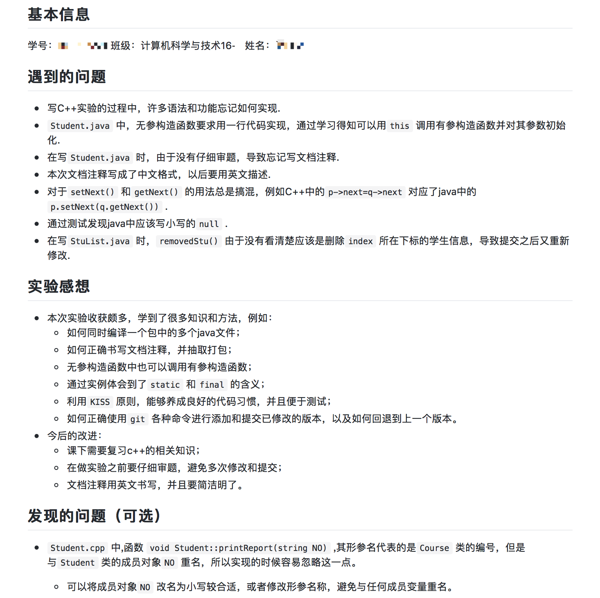
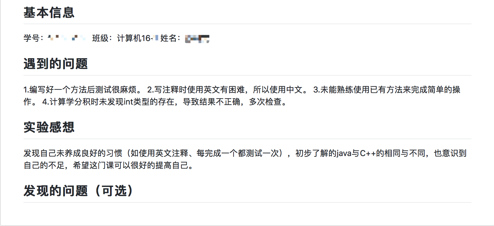

# Lab2-重构之旅第二弹，面向对象（Object Oriented）
在开展实验之前，请各位同学仔细阅读[实验前阅读](https://mybaby101.gitbooks.io/bfu-java-lab-instruction/content/)

同学们已经完成了lab1，它是整个Lab系列重构之旅的起点，接下来我们将基于lab1，运用我们第4章所学的前半部分知识 **(抽象类、接口)**，对其重构优化。
Lab2的相关代码已经放在了该git版本库中，需要同学们进一步完善这些程序。

## 实验说明
根据lab1各位同学反映的部分操作问题，再次强调并解释如下几点：
1. 各位同学通过github classroom的链接，接受了`lab2`后，会在你的github中创建一个私有项目，项目名称为`bfu-java-lab1-${github_username}`（`${github_username}`表示你的github用户名），请使用`git clone`命令将该项目的工程目录下载到你的本地。**重点：请直接在你`git clone`下来的工程目录中进行开发，不要修改工程目录的结构。**使用`eclipse`、`IntelliJ IDEA`等`IDE`进行开发的同学，**不要另外创建项目，而是使用`IDE`导入`git clone`拉取下来的工程目录**。
2. 由于`IDE`的过分强大，为我们隐藏了许多细节，根据`lab1`过程中许多同学提出的问题，可以看出来大部分同学对于如何组织一个工程项目并且手动运行自己的项目几乎“一无所知”。因此，本讲义会花费一定篇幅来介绍如果组织一个简单的工程，**同时规定lab2不能使用IDE进行开发，必须直接使用文本编辑器编写程序，并利用JDK工具进行编译运行。（推荐的文本编辑器：sublime3，ultraedit, vim）**
3. 部分同学经过`lab1`的训练之后，对于`git`的使用，已经基本入门；但仍旧有一部分同学，在使用过程中遇到了许多问题，大部分都是“一知半解”造成的。`lab2`会继续要求大家，使用`git`来管理你的工程，我们会提供一份更详细的基础教程，同时会教各位同学一些新的`git`操作，让大家逐步领略`git`大魔王的强大。
4. 正如我在`lab1`讲义中所说的，**今后的`lab`系列实验，所有的Java源程序都需要编写文档注释**，提交的实验内容需要包括抽取出来的文档网页，放在项目根目录下的`doc`目录中。正如我在实验前阅读中说明的那样，英语的使用在计算机领域是不可避免的，因此我们希望各位同学能够使用英语来书写文档注释，`lab2`和`lab3`作为过渡阶段，不做硬性规定，`lab4`会要求各位同学必须使用英语。
5. `lab1`实验过程中以及部分同学的实验报告中，都指出有些方法没有意义，或者是没有相应的测试用例。实际上，`lab1`的讲义中明确给各位同学解释过，**提供的测试用例不保证覆盖所有边界条件，不保证所有方法都有相应的测试用例**。你们提交的程序，我会使用另外的测试用例去检查正确性，因此，请自行编写足够的测试用例保证实现的正确性。此外，`lab2`还会教各位一个极其简易却又非常实用的测试技巧——`assert`。
6. 关于“手动单元测试”，`KISS`原则的实用性很多同学都在`lab1`中感受到了，许多同学都在实验报告指出，对于`lab1`中cpp版本的程序是一次性写完再测试的，调试过程非常辛苦；而要求必须实现一个方法测试一个方法的java程序，错误发现非常及时，看似繁琐，但实际上却提高了开发效率。

    在`lab3`学习`Junit`之前，`lab2`仍旧要求各位同学进行手动的单元测试，**测试粒度（单元测试的单位，可以以代码行为单位，以方法为单位，以类为单位）稍稍放宽，不必实现一个方法就测试一次，`lab2`的三个部分，每个部分最后的实现要求中会详细说明每个部分的测试粒度**，请严格按照讲义要求的测试粒度进行测试。需要强调几点：
    * **每一次完成单元测试后，`git commit`中所写的提交信息，必须严格按照讲义要求的格式书写！**
    * **新规定，按照实验讲义的要求的测试粒度，每完成一部分的单元测试后，除了`git add`添加新实现的方法所对应的java文件外，还需要`git add`添加这一次测试对应的测试类文件。** 这样，我对于你提交的版本库，使用`git reset`回滚到任一提交点，应该都可以直接运行测试你刚刚实现的方法。
    * 这里可以告诉大家的信息之一，`lab1`中已经通过你们的提交历史信息，抓出了几个抄袭学生，希望各位严格按照要求完成实验，在一些工具的使用上如果实在遇到了百度解决不了的问题，请及时联系助教。以及请各位不要抱侥幸心理，被发现抄袭的本次实验分数为0，被抄袭者的分数同样处理。

7. `lab1`要求各位使用`Markdown`的语法书写实验报告，有的同学掌握的非常好，实验报告非常清晰；但也有同学并没有按照要求书写，我们放出两张截图作为对比，立刻可以感受到差异。需要说明的是，`Markdown`真的是一个非常非常非常简单的标记语言，其[语法](https://guides.github.com/features/mastering-markdown/)的学习可能只需要不到10分钟，但是却无比实用，今后各位写博客，记录笔记，都可以使用`Markdown`记录，让自己专注于内容而不是排版。另外，同学们刚接触`Markdown`，在完成实验报告并`git push`到`github`之后，请一定看一下页面上显示的`README`内容是否正确。（我写的`TODO`，to do的意思，是留给各位填写，各位在添加内容之后，可以删掉😅）
#### 对比图1

#### 对比图2


### 提交要求：
1. Deadline: 2017.4.21 午夜12点。
2. 提交内容包括：所有要求完成的源程序，实验报告以及要求导出的文档注释目录,src和doc目录下内容此处省略。
```
    bfu-java-lab1-${github_username}
    ├── README.md
    ├── .gitignore
    ├── src       
    └── doc
```
3. 直接将该版本库使用`git push`命令推送到`github`即可完成提交。
4. 要求所有源文件均使用utf-8编码。

## 一个基本的工程目录
由于强大的`IDE`为我们接管了工程项目的管理，导致大部分同学如何组织一个工程项目知之甚少。当然这也和各位同学至今为止写的都是一两个源文件就可以搞定的小程序，并没有接触过一个较大的项目有关系。但是作为一名程序猿，掌握项目组织的基本知识仍旧是有必要的。
一个基本的工程目录的组织，实际上非常简单：
* 首先，我们习惯将我们程序猿编写的源程序放在`src`目录下
* 对于项目编译产生的可执行文件，通常放在`bin`目录下
* 如果，项目中使用了一些第三方的包，例如Java工程中的各种jar包，习惯于放在`lib`目录下
* 对于项目文档则一般放在`doc`目录下
* 同时项目根目录下一般会有一个`README`文件，保存了关于项目的一些基本介绍，和简单的使用介绍。
```
    project_root_directory
    ├── README.md
    ├── bin
    ├── src
    ├── lib    
    └── doc
```

以上就是一个基本的工程目录的组织习惯，当然实际上，随着项目规模的扩大，工程目录中会有更多的子目录或者信息文件。例如对于一些开源项目，一般其项目根目录下还有有一个`LICENSE`文件，用以记录其遵循的开源协议，但是这几个基本目录的组织形式都是相同的。

以上关于工程目录组织方式的介绍中，并没有涉及到版本管理工具，例如`git`、`svn`,以及项目构建工具，例如`maven`、`ant`、`Makefile`，在引入项目后工程目录的全貌。（上述工具只是在基本目录结构的基础上新增目录或者文件，不会更改上述的目录结构）

### 这些文件是哪来的？
介绍到这里，同学们可以打开终端，切换到一个IDE创建的工程目录下，执行`ls -a`命令(`-a`选项表示all，即查看当前目录下包括隐藏文件在内的所有文件，隐藏文件/目录即文件名以`.`开头的文件或目录)，查看IDE是如何组织工程项目的。

我们以IntelliJ IDEA组织的一个工程项目为例：
```
    2016JavaLab
    ├── .git (目录，此处省略目录下的内容)
    ├── .gitignore
    ├── src
    │   └── lab2
    │       ├── CourseFactory.java
    │       ├── ***.java   （省略其他的java源文件）
    │       └── ListInterface.java
    ├── out (与bin目录作用类似，IntelliJ IDEA的out目录更为工程化)
    │   └── production
    │       └── 2016JavaLab
    │           └── lab2      
    │               ├── CourseFactory.class
    │               ├── ***.class  （省略其他编译产生的.class文件）
    │               └── ListInterface.class    
    ├── doc (目录，此处省略目录下的内容)    
    ├── README.md
    ├── .idea 
    │   ├── fileTemplates (目录，此处省略目录下的内容)
    │   ├── *** （省略.idea目录下的其他内容）   
    │   └── workspace.xml
    └── 2016JavaLab.iml    
```

现在，让我们来仔细地分析一下上面的工程目录：
1. 首先是`.git`目录和`.gitignore`文件，**`.git`目录是创建`git`版本库的时候自动创建的，不用各位同学操心**，`.gitignore`文件是程序员编写的，随后会详细介绍。
2. 其次是`src`、`out`、`doc`3个目录以及`README.md`文件，这与我们上面介绍的基本工程目录的结构是一致的。其中需要补充说明的是：
    * `lab2`并没有使用第三方的库，所以没有`lib`目录。
    * IntelliJ IDEA的`out`目录，作用于上文介绍的`bin`目录相同，都是存放编译产生的可执行文件。有所不同的是，IntelliJ IDEA在此基础上，做了优化。我们可以看到`out`目录下的一级子目录名为`production`，也就是产品的意思。意思是，对于这个项目编译得到的可执行文件，以及其依赖的第三方包，都会被IntelliJ IDEA **自动**组织在一起，可以将`production`目录下的工程目录直接发布到生产环境中使用。**这个目录是IDEA自动为我们维护的，不需要我们操心。**
    * README文件可以作为简单的文本文件，也可以使用markdown的基本语法书写。目前托管在`github`上的项目基本全部使用`Markdown`的语法。
3.  然后剩下来一个`.idea`目录与`2016JavaLab.iml`文件，终于可以问出本节的标题，**这些文件是哪来的？**

光是从目录名称中，我们就可以看出来，`.idea`与我们使用的`IntelliJ `**`IDEA`**同名。因此，这个目录和`.iml`文件，都是IDE为了管理这个项目创建的，实际上大家熟悉的`eclipse`，`Visual Studio`等`IDE`，都会在项目的根目录下创建类似的目录或文件。一个很自然的问题，这些目录和文件是干什么用的？

反应快的同学可能已经意识到了：
* 为什么在`IntelliJ IDEA`下运行程序，编译产生的`.class`文件会被自动放到`out`目录下？
* 为什么在`eclipse`下运行程序，编译产生的`.class`文件会被自动放到`bin`目录下？

这些都是在上述`IDE`自动生成的文件中被定义好的，当然这些文件的功能不仅限于此，此处不再多加介绍。

这些文件乍听之下非常强大，有了`IDE`自动生成的这些配置文件，我们就不必自己管理工程目录啊，如果产生了这种想法的同学，那只能说`too young too simple`。先不说，这些文件的表达能力有限，许多目录结构仍旧需要程序员自己把控这一大弊端。光是 **开发环境和生产环境之间的差异**，就足够让人头疼！！！
* 习惯上，程序员都会在本地进行项目开发，例如开发一个网站，开发完成之后，需要部署到服务器上，对外提供服务。而一般服务器上是不会有`IDE`的，或者说绝大部分服务器的操作系统中连图形用户界面都是没有的，此时你的程序该如何运行，就成为了问题！并且，这些只针对`IDE`有效的文件，如果被一同部署到服务器上，自然也就成了累赘。
* 考虑另一种场景，你不是一个人在开发项目，而是多人协作，今后你们也会在软件工程的课程设计中遇到这种情况。假设你们通过`git`和`github`进行多人协作（这个话题较为高级，本课程不会要求各位进行多人协作，毕竟 **所有作业，实验，大实验都要求独立完成**），每个人习惯使用不同的`IDE`,程序员A习惯使用`IntelliJ IDEA`，而程序员B习惯使用`eclipse`，这就导致你们虽然通过`github`托管了一份工程源代码，但是工程目录下却有两种`IDE`专用的配置文件，不仅不便于管理，而且可能产生冲突，这在协作人数增多的时候问题会更为明显。

经过上文的讨论，希望各位对于`IDE`生成的配置文件所带来的问题有所理解，而如何解决这种问题，这就需要介绍`.gitignore`文件了。

### .gitignore
我们刚刚介绍，对于`IDE`生成的配置文件，在我们机器本地进行开发的时候，是非常有用的。但是托管到`github`上，无论是和其他人写作开发，还是部署到生产环境中，都是累赘。因此，**一个约定俗成的行业“潜规则”是，在使用`git`管理项目的时候，我们不把`IDE`生成的配置文件提交版本库当中。**

这就需要`.gitignore`文件，从文件名中可以看到 **ignore**（忽略），也就是说`git`在`git add`的时候会忽略`.gitignore`文件中写明的文件的修改，不将这些文件提交到版本库中。如下，就是一个`IntelliJ IDEA`项目下基本的`.gitignore`文件。
```
.idea/*
project_name.iml
```

第一行表示，忽略`.idea`及其目录下的所有文件。
第二行表示，忽略项目名称对应的`.iml`文件。（请使用`eclipse`的同学自行编写相应的`.gitignore`文件中需要忽略的内容）

在添加了`.gitignore`文件之后，`git`就不会记录此类文件，当然不要忘记把`.gitignore`本身添加到版本库中。

不知道有没有同学在看到这里的时候，思考🤔到一个问题，我们基本的工程目录中是不是还有些内容可以被忽略！观察过我`lab1`的`.gitignore`文件内容的同学，可能会发现，我 **把`out`目录及其子目录也都忽略了**！这是因为，`out`或者`bin`目录下的文件，都是编译产生的，只要有任一时刻的源程序，我们随时可以编译得到对应的`.class`文件。忽略这些文件，可以减小`git`所需要追踪的文件变化的数量，减小你`git`版本库的容量！**约定俗成的行业“潜规则”之二，在使用`git`管理项目的时候，编译产生的文件也需要被忽略！**

实际上讨论到这里，关于一个基本的工程目录差不多就告一段落了，要求各位同学在接下来的实验过程中 **脱离IDE，利用文本编辑器编写程序，并且使用JDK工具编译和运行程序！**（放心，伴随lab3的到来，将会解禁`IDE`）
* 其中需要注意的是，编译的时候请指定`.class`文件的输出路径。（hint: javac -d）
* 编写`.gitignore`文件，由于不能使用`IDE`，因此仅需要忽略`bin`目录下的内容。

## 多占据的空间给我还回来
lab1的最后，让各位同学指出lab1程序设计中的不足之处。可惜的是大部分同学都没有指出`Course`类的空间冗余问题。对于每个学生来说，该学生的成绩清单所需要保存理当只是所选修课程的课程编号（唯一标识）以及分数，但是lab1的设计中，每个学生都保存了一个课程的完整信息（课程编号，课程名称，学时）。也就是说，当有n个学生选修同一门课程的时候，这门课程的基本信息在内存中就会有n份一模一样的拷贝，造成了大量的内存冗余。此处，我们给出一种可行的解决方案，该解决方案旨在解决问题的同时，让各位同学尽可能练习学习过的知识点，因此并非最佳方案。

首先，我们将课程自身的信息与学生各自的分数解耦，使得`Course`课程类可以只保存自身的基本信息，如下是新的`Course`类的源码(`lab2\Course.java`)，我们删去了与课程自身信息无关的`score`字段以及`next`字段，添加了`credit`学分字段，同时为课程信息添加了一个构造器。
```
package lab2;

public class Course {
    private String courseNumber;
    private String courseName;
    private double credit;
    private int courseHour;

    public Course(String courseNumber, String courseName, double credit, int courseHour) {
        this.courseNumber = courseNumber;
        this.courseName = courseName;
        this.credit = credit;
        this.courseHour = courseHour;
    }

    // omit all the getter & setter
}
```

为了取代原有`Course`类组织学生的成绩单链表，我们创建一个新的`CourseScore`类(`lab2\CourseScore.java`)，仅包含课程及其对应分数的映射关系，以及一个`next`字段用以组织链表。
```
public class CourseScore {
    private Course course;
    private double score;
    private CourseScore next;

    // omit all the getter & setter
}
```

再引入`CourseScore`类之后，`Student`类(`lab2\Student.java`)自然要做出相应的修改。需要说明的是，在如下的程序示例中，以`-`号开头的代码行表示与原来的版本相比被删除了，相应地，以`+`号开头的代码行表示相比原版新增的代码行。同时，为了讲义篇幅考虑，没有列出所有引入`CourseScore`类之后代码修改，需要同学们自己再lab1的基础上进行改动。
```
public class Student {
    // omit other fields & methods
    -private Course report;
    +private CourseScore report;

    // Here omit other modifys about CourseScore
}
```

看到上面的代码示例，很多同学估计有所疑问，**为什么不是用课程编号来唯一标识一门课程，而是使用课程类的引用？**正如前文所说的，我们给出的解决方案并不一定是最优的，使用课程编号当然可以达到我们的目的，但是使用课程引用也未尝不可，关键在于 **保证课程标识符的唯一性！** 如果非要说使用课程引用相较于课程编号有什么优势，那就是出于存储的考量，假设一个长度为8的课程编号，在内存中需要占据16字节，而一个引用变量仅需要4个字节。

课程编号，当然可以保证每一门课程可以被唯一标识；但是，课程类的引用要想保证唯一标识一门课程，意味着 **这门课程在内存中只能有一个实例！所有的这门课程的引用变量都将指向该实例！**
### 解法1：static
为了达到上述目的，首先，需要将创建课程实例的任务从我们手中解放出来，全部委托给一个 **课程工厂**(`lab2\CourseFactory.java`)，由它负责课程的实例化，今后所有创建课程实例的操作都改为向这个工厂获取产品。为了保证所有课程实例的唯一性，很自然的一个解决方案就是，将`Course`实例作为`CourseFactory`的类变量，在`CourseFactory`内部进行初始化，并且不对外提供修改的接口，那么每次通过`getCourse`方法，返回的`Course`类实例必然唯一。

```
public class CourseFactory {
    private static Course[] allCourses;

    public static Course getCourse(String number) {
        // TODO, please use foreach instead of normal for loop
    }

    // TODO，the initial operation
}
```

### 解法2：单例+工厂模式
除了上述方案来保证`Course`实例的唯一性外，还有什么方法吗？必须要用`static`类型的变量吗？普通的实例变量不可以吗？显然是有其他的解决方案的，不然我的连续追问都成了废话。不知道各位同学是否还记得chapter3作业题的第7题，当时在讨论`private`修饰构造器的作用时候，我给出了一个提示——`单例模式`。如果说`CourseFactory`在内存中也仅有一个实例，那么他的实例变量在”内部初始化“之后，且不提供对外的修改接口的情况下，是不是也能保证`Course`类实例的唯一性了?

```
public class CourseFactory {
    private static CourseFactory instance;
    private Course[] allCourses;

    // TODO，the initial operation, hint: private constructor

    public static CourseFactory getInstance() {
        // TODO
    }

    public Course getCourse(String number) {
        // TODO, please use foreach instead of normal for loop
    }

}
```

### 实现要求
lab2的第一部分在引入`CourseScore`类解决`Course`类基本信息的内存冗余问题的同时，利用上述的两种方案保证`Course`类实例的唯一性，要求：学号为奇数的同学使用解法1，学号为偶数的同学使用解法2，实现的时候 **需要同学们思考”内部初始化“可以有哪些方案**。
为了进一步简化实现复杂度：假设该系统仅含有如下的10门课程：

课程编号|课程名称|学分|学时
-------|-------|---|---
IT1000|体系结构|2|40
IT1001|编译原理|3|60
IT1002|操作系统|3|60
IT1003|数据结构|2|40
IT1004|算法设计|1.5|50
IT1005|程序设计基础|2|40
IT1006|数据挖掘|1.5|40
IT1007|机器学习|1.5|40
IT1008|并行计算|1.5|40
IT1009|计算机网络|3|60

### 新的测试利器 —— assert
在lab1中，我给大家介绍了KISS这一系统设计的黄金法则，在文字介绍中提到过“一种好的测试方式是使用assertion进行验证, 学会使用assertion, 对程序的测试和调试都百利而无一害.”

现在我们将带大家学习`assertion`，也就是 **断言**，这一程序设计中被广泛使用的测试技巧。我们在日常编写代码时，总是会做出一些假设，例如对象不为空，输入的字符串长度，顺序表大小等，断言就是用于在代码中捕捉这些假设，用以在程序中的某个特定点检测这些假设是否为真。断言表示为一些 **布尔表达式**，可以将断言看作是异常处理的一种高级形式。断言在主流的编程语言中都有所支持，例如我们熟悉的C语言等，我们的java语言在Java 4的版本中也添加了对这一特性的支持，有如下两种语法形式：

1 assert condition;
    这里condition是一个必须为真(true)的表达式。如果表达式的结果为true，那么断言为真，并且无任何行动。如果表达式为false，则断言失败，则会抛出一个`AssertionError`对象。这个`AssertionError`继承于`Error`对象，而`Error`继承于`Throwable`，`Error`是和`Exception`并列的一个错误对象，通常用于表达 **系统级运行错误**。
    
2 asser condition:expr;
    这里condition是和上面一样的，这个冒号后跟的是一个表达式，通常用于断言失败后的提示信息，说白了，它是一个传到`AssertionError`构造函数的值，如果断言失败，该值被转化为它对应的字符串，并显示出来。

对于上述的`Error`、`Exception`等java异常相关的类，我们将在第六章有详细的介绍，现在让我们通过一个程序示例来学习`assert`：

```
public class TestAssert{
     public static void main(String[] args){
         String name = null;
         assert (name!=null):"变量name为空null";
         System.out.println(name);
     }
}
```

上述程序演示了一个常见的假设，我们在编写程序的时候，总是默认对象不为空，但实际上天不遂人愿，空指针异常是实际开发过程中最常见的错误。利用assert，**让我们可以暂时忽略对象为空的情况，而专心于正常的业务流程**，如果对象为空了，会触发`AssertionError`，根据其提示信息让我们可以在后续的开发过程中逐渐完善。可能很多同学会觉得，如果使用if语句配合System.out.println()方法不是也可以做到类似的效果吗？为什么一定要用`assert`?原因主要由两点：第一，**assert语句更为简洁**；第二，assert语句可以直接触发异常，相比观察System.out.println()的输出信息，可以 **更快锁定出错位置**，下图展示了上述程序运行时所触发的`AssertionError`我们可以看到直接锁定了发生错误的行号。


需要指出的是，**必须不依赖`assert`完成任何程序实际所需的行为**。理由是正常发布的代码都是断言无效的，即正常发布的代码中断言语句都不不执行的（或不起作用的）。我们应该仅仅使用`assert`来 **检验**程序的前置条件、后置条件或者是前后不变的条件，而不能将其作为一个分支语句来使用。正因为如此，jvm的断言默认是关闭的，需要我们在运行的时候手动指定`-ea`选项打开jvm的assert支持，即运行程序时需要 java **-ea** 主类名。

关于`assert`的基本讲解就暂时到这里了，后续的单元测试检测实现方法的正确性的时候，希望各位同学使用`assert`断言，这样同学们的测试方法的编写能够更为高效。另外，也希望同学们在今后的编程当中，灵活使用`assert`将一些假设和验证暂时使用`assert`放在一边，而转心于主要的业务流程，这也正是KISS的体现。

#### 单元测试粒度
对于lab2第一部分，单元测试分为两个部分：
1. 需要同学们在`lab1`的`Student`类基础上引入`CourseScore`类后，进行`Student`类中其他方法的改造后，进行各改造方法的正确性测试，测试通过之后，记录一次提交（git add, git commit）。提交信息：“use CourseScore organize the linked list instead of Course”
2. 同学们根据各自的学号，实现解法1或者解法2之后，需要再次进行正确性证明，测试通过之后，记录一次提交。提交信息：“use strategy 1 or 2 to ensure the uniqueness of the Course instance”


## 学生？小学生？中学生？大学生？研究生？
解决了lab1中的一个遗留问题之后，我们就要针对第4章新学习的内容，继续重构lab1了。看到本节的标题，大家可以猜到本节需要考核的知识点就是抽象类。先前的`Student`类太过泛化，就以大学校园为例，本科生与研究生显然有诸多不同，相比各位本科生而言，研究生多了导师，多了自己的研究方向，并且gpa的计算方式也有所不同。

因此，我们将`Student`类(`lab2\Student.java`)改为抽象类，并且分别派生出两个子类`Undergraduate`（`lab2\Undergraduate.java`,本科生）以及`Postgraduate`（`lab2\Postgraduate.java`,研究生）。

```
public abstract class Student {

    protected abstract void calcAverScore();
    protected abstract void printReport();

    public void printReport(String NO) {
        // TODO
    }
    // omit other fields & methods
}

public class Undergraduate extends Student {
    public Undergraduate(String name, int NO) {
        // TODO, please use just one line code
    }

    protected void calcAverScore() {
        // 四分制算法GPA
        // TODO
    }

    public void printReport() {
        // TODO
    }
}

public class Postgraduate extends Student {
    private String tutor;
    private String researchArea;

    public Postgraduate(String name, int NO, String tutor, String area) {
        // TODO
    }

    protected void calcAverScore() {
        // 加权平均的GPA (各科成绩按学分的加权平均数 * 4 / 100)
        // TODO
    }

    public void printReport() {
        // TODO
    }

    public String getTutor() {
        return tutor;
    }
    // omit the getters & setters 

}
```

### 实现要求
lab2的第二部分就是请各位同学完成`Student`的抽象化，上述三个类的框架代码在lab2中已经给出，请各位同学完成`TODO`部分，具体的实现要求如下：
1. 假设该高校对于在校本科生与研究生的**GPA**(Grade Point Average, 平均学分绩点)计算方式有所不同：
    * 对于本科生，采用四分制算法GPA：对于每一门课程的 **得分score**[0, 100], 换算成相应绩点，[90， 100]算4绩点，[80, 90)算3绩点，[70, 80)算2绩点，[60, 70)算1绩点，[0, 60)算0绩点。
    
    **课程学分绩点**=课程绩点×课程 **学分credit**

    GPA(4分制)=∑(课程学分×课程绩点)/∑课程学分=各门 **课程学分绩点**之和/各门课程学分数之和
    * 对于研究生，采用加权平均的GPA算法：对于每一门课程的 **得分score**，根据课程 **学分credit**计算加权平均数，然后乘以4除以100即可。

    GPA(加权平均)=∑(课程学分×成绩得分)/ ∑（课程学分）* 4 / 100
2. 我们在第4章简单学习了多态的概念，我们此处利用本科生与研究生相异的GPA计算行为来深入探讨一下多态。Java的引用类型的变量实际上分为两种类型：一个是 **编译时类型**，一个是 **运行时类型**。编译时类型由 **声明**该变量时使用的类型决定，运行时类型由 **实际赋值**给该变量的对象决定。

    将上述的学术语言，翻译到下述程序当中，意思即为引用类型变量`s`在我们编写程序的过程中声明为`Student`类型，因此其编译时类型为`Student`，即在程序编译过程中，编译器将`s`所引用的对象作为`Student`类型的实例看待，如果`s`变量调用`Student`类的方法，例如`printReport(String)`方法，并不会发生编译错误；但是如果`s`变量调用了`Postgraduate`类新增的方法，例如`getTutor()`方法，编译器在编译程序的过程的当中，就会发生编译时错误。

    ```
    Student s = new Postgraduate(...);  // 此处省略构造器参数
    ```

    所谓的`多态`（Polymorphism），正是编译时类型与运行时类型不一致的时候，所 **可能**出现的行为。

    **要求同学们在进行单元测试的时候，需要使用上述把子类对象赋值给父类引用变量的方式来测试子类实现方法的正确性，即向上转型（`upcasting`）。通过这种方式来进一步体会，运行时多态。**

    **必答题**：
    1. 为什么讲义中强调，`多态`是编译时类型与运行时类型不一致的时候，所 **可能**出现的行为？除了`多态`，还可能发生怎样的行为？
    2. 讲义中介绍的 **向上转型** 总是可以成功的，那么把一个父类对象赋值给子类引用变量的时候，是否总能成功？是否需要做什么额外操作？如何保障这种额外操作的安全性？

3. 细心的同学们可能在讲义中发现了，`Student`抽象类中的两个抽象方法，都是`lab1`中的熟面孔，将他们定义为抽象方法，正是因为其子类有不一致的行为，`calcAverScore()`方法的行为差异源自本科生与研究生的GPA计算方式不同，实现要求1已经做过详细介绍，此处不再赘述。`printReport()`方法，对于本科生而言，其行为与`lab1`一致，输出该学生的完整成绩表，包括姓名、学号、学分积以及所有课程信息；而研究生相比于本科生的输出信息外，还需要输出其导师以及研究方向信息。
    ```
    protected abstract void calcAverScore();
    protected abstract void printReport();
    ```

    说明完了`abstract`修饰符，我们来观察一下这两个方法的访问控制符，下面4个问号提出的问题为`lab2`的必答题部分：
    * 相比于`lab1`，抽象父类`Student`中的`calcAverScore()`方法的访问控制符由`private`变为了`protected`，why❓而在其子类中，该方法的访问控制符仍旧是`protected`，why❓
    * 相比于`lab1`，抽象父类`Student`中的`printReport()`方法的访问控制符由`public`变为了`protected`，why❓而在其子类中，该方法的访问控制符又被改为了`public`，why❓

#### 单元测试粒度
对于lab2第二部分，单元测试也分为两个部分：
1. 请首先对`Student`类进行改造，将其变为一个抽象类之后，首先实现`Undergraduate`类，在实现并测试通过上述两个步骤后，记录一次提交。提交信息：“convert Student class into abstract, create a Undergraduate class extends the new Student abstract class”
2. 接下来请创建一个`Postgraduate`类继承自`Student`类，同样对`Postgraduate`类的正确性进行测试后，记录一次提交。提交信息：“create a Postgraduate class extends the Student abstract class”

## 学生表进化版
lab2的第二部分让大家练习了抽象类的使用，紧接着我们将继续对于`lab1`的学生表进行重构，其围绕的主题为接口(`Interface`)。lab2的第三部分，我们将会对接口做最低限度的简单练习，紧接着的`lab3`会结合泛型，对于接口做深入探索。

在lab1的实验报告中部分同学反馈，`lab1`中的`StuList`类的方法描述不够清晰，例如对于`removeStu(int)`的参数是按数组索引（从0开始）还是按习惯的学生序号（从1开始）有所疑惑，有这样的困惑一方面由于我确实没有做出说明有关，另一方面也是因为同学们还习惯于日常生活中从1开始计数的方式，实际上我在框架代码中所给出的`removeStu(int index)`的方法声明中的`index`参数名已经有所提示，在计算机科学中如果没有特殊说明，`index`都是从0开始。还有一部分同学在`lab1`的实验报告中还说`indexOf(int)`方法没有用，这说明这些同学并没有完全理解框架代码的设计用意，实际上利用好`indexOf(int)`方法，`removeStu_id(int)`方法的实现仅需要1行，关于`lab1`的补充就提示到这里。

在lab2中正好我们可以使用接口对学生表的基本行为进行规范，来避免`lab1`中方法描述不够清晰的地方。我们定义一个`StuListInterface`接口(`lab2\StuListInterface.java`)，其中包括有`StuList`类的基本行为并在文档注释中做出了相应说明.

```
public interface StuListInterface {
    /**
     * Returns true if this Student list contains no elements.
     * @return true if this Student list contains no elements.
     */
    boolean isEmpty();

    /**
     * Returns the number of Students in this StuList.
     * @return the number of Students in this StuList
     */
    int size();

    /**
     * Appends the Student s to the end of Student list.
     * @param s Student to be appended to this StuList
     * @return true if the StuList has enough space to append a Student
     */
    boolean addStu(Student s);

    /**
     * Removes the Student at the specified position in this StuList.
     * Shifts any subsequent Students to the left (subtracts one from their indices).
     * @param index the index of the Student to be removed
     * @return the Student that was removed from the StuList
     */
    Student removeStu(int index);

    /**
     * Removes the Student whose id equals the id parameter in this StuList.
     * Shifts any subsequent Students to the left (subtracts one from their indices).
     * @param id the id of the Student to be removed
     * @return the Student that was removed from the StuList
     */
    Student removeStu_id(int id);

    /**
     * Sort the Students List by GPA.
     */
    void sort();

    /**
     * Output the basic information of each Student in StuList.
     * The basic information includes StuID, Name, GPA
     */
    void print();
}
```

上述代码对学生表的基本行为做出了规范，请各位同学编写`StuList`类实现上述接口，**强烈建议各位同学仔细思考`lab1`的`StuList`类中的所有方法**，其中的奥妙需要你来发现！

```
public class StuList implements StuListInterface {
    private Student[] stus;
    private int length;   // the actual number of student it contains
    private static final int DEFAULT_CAPACITY = 15;   // default initial capacity

    /**
     * Init the StuList using the default capacity
     */
    public StuList() {
        // TODO，please use just one line code
    }
    
    /**
     * Init the StuList using the given cap
     * @param initialCapacity the initial capacity of the StuList
     */
    public StuList(int initialCapacity) {
        // TODO
    }

    // omit other methods
}
```

### 单元测试粒度
lab2的第三部分，只需要在`lab1`的基础上，让`StuList`类实现`StuListInterface`接口，保证新的`StuList`中的所有方法的正确性之后，记录一次提交即可。提交信息：“create a StuListInterface, make the original StuList implements it”。
综上，lab2的三个部分，一共要求大家提交五次commit信息，请各位同学严格按照要求，书写提交信息，如果开发过程中有所修改，可以多次提交，但**至少包含这五次提交，否则将会严重影响你lab2的实验成绩**。

# 实验报告
**看到这里，各位同学终于完成了lab2的全部内容，接下来请各位同学在本篇文档的后半部分完成实验报告，和lab1一样，我们不需要八股文式的实验报告，在填写完基本信息后，你所要做的只是记录下你在实验过程中遇到的问题以及你的实验感想。同时对于lab2实验讲义中提出的一些问题，请将你的思考结果写在实验报告的必答题部分当中。注意：请使用`Markdown`的[基本语法](https://guides.github.com/features/mastering-markdown/)来书写实验报告。**

## 基本信息
学号：
班级：
姓名

## 必答题
1. 为什么在lab1中要求同学们进行手动单元测试验证方法正确性之后，`git commit`要求撰写的提交信息为 **complete method delCourse(String)**，方法标识符既没有要求写返回值，也没有要求参数名？这和我们学习过的哪个知识点是相契合的？

    please write your answer here.

2. 在lab2的第一部分，为了保证Course类的实例的唯一性，我们提供了两种解法，框架代码中省略了内部初始化的代码，请各位同学在下方给出两种初始化方案。

    please write your answer here.

3. 为什么讲义中强调，`多态`是编译时类型与运行时类型不一致的时候，所 **可能**出现的行为？除了`多态`，还可能发生怎样的行为？

    please write your answer here.

4. 讲义中介绍的 **向上转型** 总是可以成功的，那么把一个父类对象赋值给子类引用变量的时候，是否总能成功？是否需要做什么额外操作？如何保障这种额外操作的安全性？

    please write your answer here.

5. 相比于`lab1`，抽象父类`Student`中的`calcAverScore()`方法的访问控制符由`private`变为了`protected`，why❓而在其子类中，该方法的访问控制符仍旧是`protected`，why❓

    please write your answer here.

6. 相比于`lab1`，抽象父类`Student`中的`printReport()`方法的访问控制符由`public`变为了`protected`，why❓而在其子类中，该方法的访问控制符又被改为了`public`，why❓

    please write your answer here.

## 遇到的问题
TODO

## 实验感想
TODO

## 发现的问题（可选）
TODO

